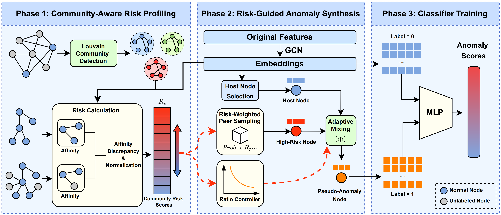

# CR-Aug: Community Risk-Guided Adaptive Augmentation for Semi-supervised Graph Anomaly Detection

> This is the official PyTorch implementation of the paper **"CR-Aug: Community Risk-Guided Adaptive Augmentation for Semi-supervised Graph Anomaly Detection"**.


## Overview

In this work, we propose a novel generative framework for semi-supervised graph anomaly detection, which is the first to explicitly incorporate community-aware priors into pseudo-anomaly generation. 

We introduce CR-Aug, a community risk-guided adaptive augmentation framework composed of two tightly coupled modules: Community Risk Profiling (CRP) and Risk-Guided Synthesis (RGS). 
CRP characterizes latent anomaly risk at the community level by measuring affinity discrepancy, while RGS leverages risk-weighted sampling and risk-inverse adaptive mixing to generate diverse pseudo-anomalies, providing more discriminative supervision for classifier training.




## 🛠️ Installation

1. Create a virtual environment and install the required dependencies:

```
conda create -n craug python=3.10
conda activate craug
pip install -r requirements.txt
```

*(Main dependencies include `torch`, `dgl`, `scipy`, `numpy`, and `scikit-learn`.)*


## 📦 Data Preparation & Community Partitions

**Unzip the Data:**

```bash
unzip datasets.zip
```

We provide the pre-computed Louvain community partitions for all datasets in the `./dataset/partition/` directory.


## 🚀 Quick Start

You can easily train and evaluate the CR-Aug framework using the `run.py` script. The script automatically handles data loading, community risk profiling, augmentation, and model optimization.

**Run on the Photo dataset:**

```
python run.py --dataset photo
```

**Run on the T-Finance dataset:**

```
python run.py --dataset t_finance
```


